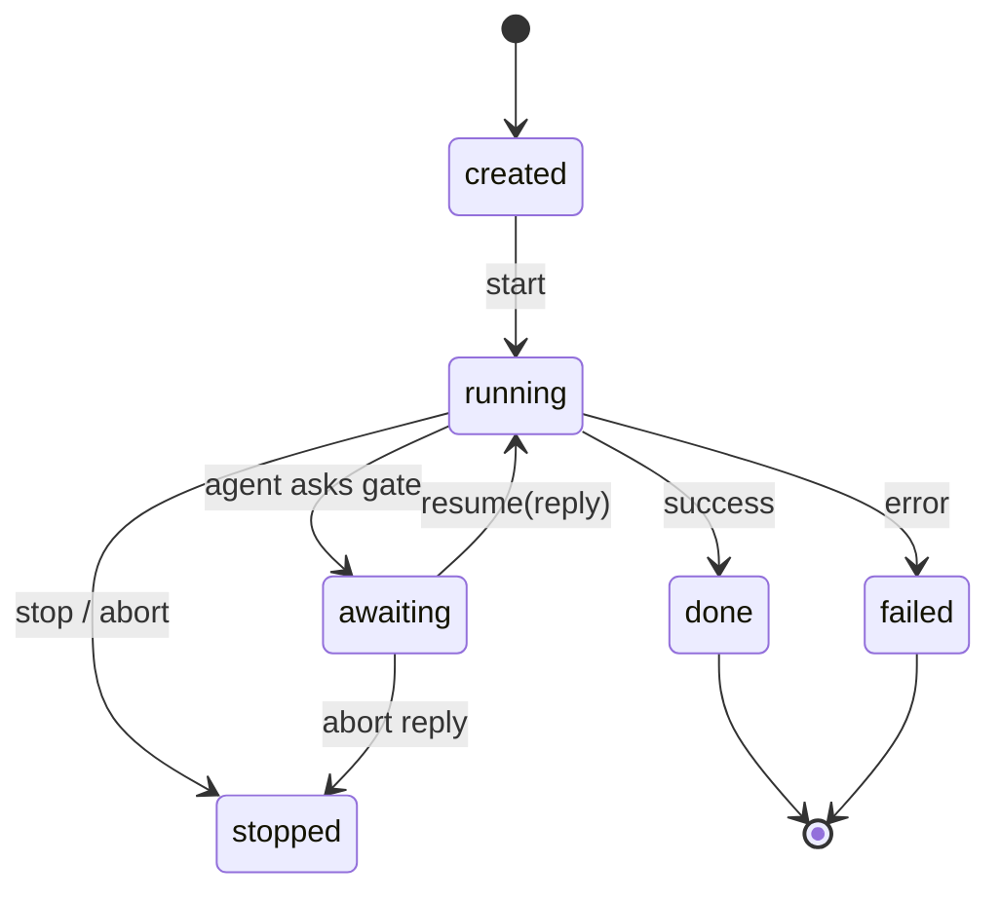
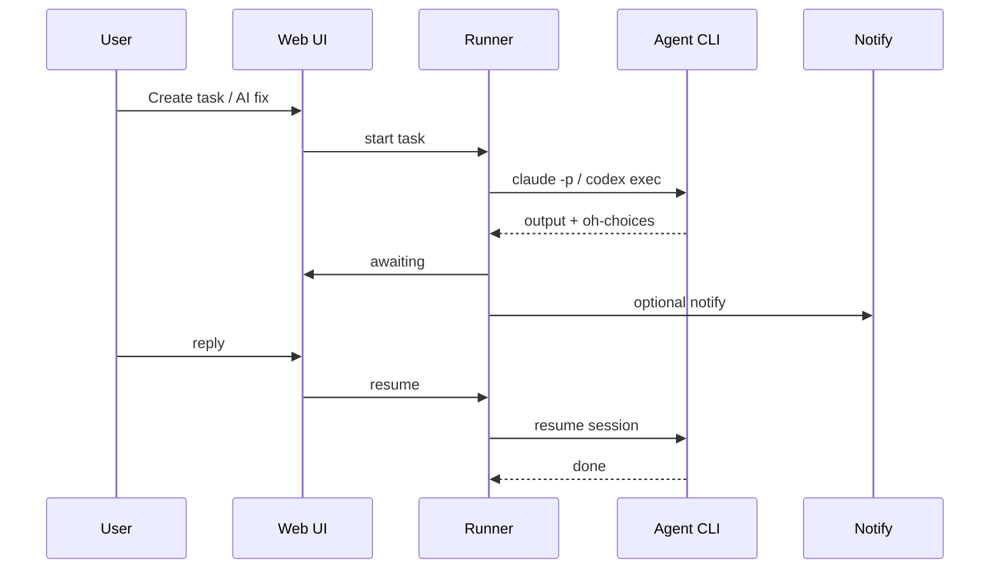

<p align="center">
  <a href="https://github.com/yangjieling/agent-desk">
    
  </a>
  <br><br>
  <strong style="font-size:40px;font-weight:700;letter-spacing:-0.02em;color:#202124">agent-desk</strong>
  <br>
  <sub>local agent harness · gates · workflows</sub>
</p>

# agent-desk

**Coding agents that pause for approval.**

agent-desk is an open-source, **local-first** harness for AI coding agents. Run Claude Code or Codex
from a Web UI or CLI, orchestrate multi-step workflows, stop on human gates, and notify your team
when a decision is needed — without shipping a cloud control plane.

[](LICENSE)

**English | [简体中文](README.zh.md)**

[Architecture](#architecture) · [Quick start](#get-started) · [docs/architecture.md](docs/architecture.md) · [docs/providers.md](docs/providers.md) · [docs/skills.md](docs/skills.md)

---

## What is agent-desk?

You already run `claude` or `codex` in a terminal. Each session is a black box: hard to replay,
easy to lose context, and risky to let run unattended. When you want **fix this issue → confirm the
plan → run tests → notify me**, you end up re-prompting and watching the tab.

agent-desk wraps those CLIs in a small harness on your machine:

- **Tasks** with a clear lifecycle (`created → running → awaiting → done`)
- **Workflows** (shared or independent steps) driven by YAML templates
- **Human gates** parsed from agent output (`## oh-choices`)
- **Notifications** (webhook, Feishu, DingTalk) with deep links back to the gate
- **Skills** as portable `SKILL.md` packs mounted into the agent prompt

Data stays under `~/.agent-desk` (SQLite + files). JSON Schemas in `schemas/` keep task/workflow
shapes portable.

---

## Run the work.

*From a GitHub issue, a skill task, or a full fix pipeline.*

- **Agent backends →** [Claude Code](#agent-runtimes) and [Codex](#agent-runtimes) via local CLI spawn (`claude -p`, `codex exec`).
- **[Workflows](templates/workflows/) →** `shared` (one session, many steps) or `independent` (parallel child tasks).
- **[Skills](docs/skills.md) →** Discover, sync, and inject `SKILL.md` + `--add-dir` mounts at task start.
- **Issue → task →** GitHub Issues provider, **AI 修复** from the defects list, optional auto workspace clone.

## Stay in the loop.

*The agent proposes; you approve.*

- **Human gates →** Agent emits `## oh-choices`; task moves to `awaiting` until you reply in the UI or via notify link.
- **Execution log →** Timestamped stdout/stderr in the task timeline (raw JSONL available in the drawer).
- **Notify →** Webhook, Feishu/Lark cards, DingTalk ActionCard or interactive Stream cards.
- **Resume / stop →** Continue with a reply, abort with `先不修` / `skip`, or stop a running task from the UI.

## Make it yours.

*Pluggable providers, no vendor lock-in on the harness.*

- **[Provider interfaces](docs/providers.md) →** Swap Agent, Issue, and Notify backends in code.
- **Settings UI →** Default agent, GitHub repo, DingTalk credentials, fix workflow vs skill-only mode.
- **Environment overrides →** `AD_*` variables override stored settings when set ([configuration](#configuration)).
- **Schema-first →** Task, workflow, and settings shapes in `schemas/` for tooling and interchange.

---

## Get started

**Prerequisites:** [Node.js](https://nodejs.org/) 20+, [pnpm](https://pnpm.io/) 9+, and at least one
[agent CLI](#agent-runtimes) installed and authenticated on the machine that runs `oh web`.

```bash
git clone https://github.com/yangjieling/agent-desk.git
cd agent-desk
pnpm install && pnpm build

pnpm cli web          # background (default)
# pnpm cli web --foreground
# pnpm cli web --stop
```

Open **http://127.0.0.1:19877**

```bash
pnpm cli tasks create -t "Hello" -p "Say hi." --skill triage
pnpm cli workflows list
pnpm cli workflows run sys-fix-pipeline -p "Issue: login button broken"
```

**CLI tips:** run from the repo root; use `pnpm cli <cmd>` or `oh` after `npm link` in `packages/cli`.

---

## Your first task in five minutes

**1. Install an agent CLI.** `claude login` or `codex login` on the host that will run tasks.

**2. Start the harness.** `pnpm cli web` and open the Web UI.

**3. Pick a workspace.** **新建任务** → choose the project directory the agent should work in.

**4. Create and run.** Enter a prompt (or open a gate demo with `oh-choices` in the prompt). Submit —
watch logs, reply when status becomes **awaiting**.

**From a GitHub issue:** configure **Settings → GitHub**, then **缺陷** → **AI 修复** (workflow or skill mode).

---

## Agent runtimes

agent-desk does not ship a model. It drives the CLIs you install locally.

| Provider | CLI | Settings key | Env override |
| --- | --- | --- | --- |
| Claude Code | `claude` | `Settings.codingAgent`: `claude` | `AD_CLAUDE_BIN` |
| OpenAI Codex | `codex` | `Settings.codingAgent`: `codex` | `AD_CODEX_BIN`, `AD_CODEX_MODEL` |
| Cursor Agent | `agent` | `Settings.codingAgent`: `cursor` | `AD_CURSOR_BIN`, `AD_CURSOR_MODEL`, `CURSOR_API_KEY` |

```bash
# Verify before creating tasks
claude --version && claude -p "say hi"
codex --version && codex exec --json -C . "say hi"
agent --version && agent -p --trust --output-format text "say hi"
```

Credentials live in each CLI (`ANTHROPIC_API_KEY`, `claude login`, `OPENAI_API_KEY`, `~/.codex/config.toml`) — not in agent-desk SQLite.

More backends: implement `@agent-desk/provider-agent` and register at startup — see [docs/providers.md](docs/providers.md).

---

## Documentation

| I want to… | Start here |
| --- | --- |
| Understand the design | [docs/architecture.md](docs/architecture.md) |
| Wire GitHub Issues / notify channels | [docs/providers.md](docs/providers.md) |
| Use or author skills | [docs/skills.md](docs/skills.md) |
| Learning checklist vs Multica | [docs/learn-from-multica.md](docs/learn-from-multica.md) |
| Task session UI improvements (planned) | [docs/task-session-ui.md](docs/task-session-ui.md) |
| See task states and gates | [Architecture → Task lifecycle](#architecture) below |
| Configure env vars | [Configuration](#configuration) |
| Develop the monorepo | [Development](#development) |

---

## Architecture

```
     Web UI (static)  ·  oh CLI
              │
              ▼
     ┌─────────────────┐
     │  Fastify server │──────► SQLite (~/.agent-desk)
     └────────┬────────┘
              │
     ┌────────┴────────┐
     │ workflow engine │──► YAML templates, shared / independent runs
     └────────┬────────┘
              │
     ┌────────┴────────┐
     │     runner      │──► skills mount, gate parse, notify
     └────────┬────────┘
              │ spawn
     ┌────────┴────────────────────────┐
     │  claude  ·  codex  (+ providers) │
     └──────────────────────────────────┘
```

| Layer | Stack |
| --- | --- |
| UI | Static HTML/CSS/JS (`@agent-desk/ui`) |
| API | Fastify (`@agent-desk/server`) |
| Engine | TypeScript workflow + runner (`@agent-desk/workflow`, `@agent-desk/runner`) |
| Storage | SQLite (`@agent-desk/db`) |
| Agents | Local CLI backends (`provider-agent-*`) |
| Schemas | JSON Schema in `schemas/` |

### Task lifecycle



### End-to-end flow



Package graph and gate protocol: [docs/architecture.md](docs/architecture.md).

---

## Workflow modes

| Mode | Behavior |
|------|----------|
| **shared** | One agent session across steps; orchestrator injects step prompts |
| **independent** | Each step is a separate task (can run in parallel) |

Templates: `templates/workflows/*.yaml` · User workflows: `~/.agent-desk/workflows/`

**缺陷 AI 修复:** Settings → **缺陷 AI 修复流程** (e.g. `sys-fix-pipeline`) or **单任务（技能模式）**.

---

## Configuration

Web **Settings** persist to `~/.agent-desk/agent-desk.db`. Non-empty `AD_*` env vars override stored values.

<details>
<summary><strong>Environment variables</strong> (click to expand)</summary>

### Server

| Variable | Description |
|----------|-------------|
| `AD_DATA_DIR` | Data directory (default `~/.agent-desk`) |
| `AD_PORT` | Server port (default `19877`) |
| `AD_HOST` | Server host (default `127.0.0.1`) |

### Coding agent

| Variable | Description |
|----------|-------------|
| `AD_CLAUDE_BIN` | Claude CLI binary (default `claude`) |
| `AD_CODEX_BIN` | Codex CLI binary (default `codex`) |
| `AD_CODEX_MODEL` | Optional model for Codex (`-m`) |
| `AD_CURSOR_BIN` | Cursor Agent CLI binary (default `agent`) |
| `AD_CURSOR_MODEL` | Optional model for Cursor (`--model`) |

### Notify — webhook

| Variable | Description |
|----------|-------------|
| `AD_NOTIFY_WEBHOOK_URL` | Webhook URL for gate/task notifications |

### Issue — GitHub

| Variable | Description |
|----------|-------------|
| `AD_GITHUB_TOKEN` | GitHub PAT |
| `AD_GITHUB_REPO` | `owner/repo` |
| `AD_GITHUB_PROJECT_DIR` | Default checkout path |
| `AD_GITHUB_API_BASE` | API host (default `https://api.github.com`) |

### Notify — Feishu / Lark

| Variable | Description |
|----------|-------------|
| `AD_FEISHU_APP_ID` | App id |
| `AD_FEISHU_APP_SECRET` | App secret |
| `AD_FEISHU_RECEIVE_ID` | Recipient |
| `AD_FEISHU_RECEIVE_ID_TYPE` | Default `open_id` |
| `AD_FEISHU_API_BASE` | Default `https://open.feishu.cn` |

### Notify — DingTalk

| Variable | Description |
|----------|-------------|
| `AD_DINGTALK_WEBHOOK` | Robot webhook URL |
| `AD_DINGTALK_SECRET` | SEC secret (加签) |
| `AD_DINGTALK_KEYWORD` | Custom keyword |
| `AD_DINGTALK_APP_KEY` | App key (工作通知) |
| `AD_DINGTALK_APP_SECRET` | App secret |
| `AD_DINGTALK_AGENT_ID` | Agent id |
| `AD_DINGTALK_USER_IDS` | Comma-separated userids |
| `AD_DINGTALK_API_BASE` | Default `https://oapi.dingtalk.com` |
| `AD_DINGTALK_WRAP_LINKS` | `1` (default) wrap links for PC browser |
| `AD_DINGTALK_OPEN_API_BASE` | Default `https://api.dingtalk.com` |
| `AD_DINGTALK_CARD_TEMPLATE_ID` | Stream interactive card template (`xxx.schema`) |

### Skills

| Variable | Description |
|----------|-------------|
| `AD_SKILL_DIRS` | Extra skill roots |
| `AD_BUNDLED_SKILL_DIR` | Override bundled `templates/skills` |
| `AD_SKILL_PROMPT_MAX_CHARS` | Max injected SKILL.md chars (default `100000`) |

DingTalk 也可在 Web **设置 → 钉钉** 配置；改 AppKey/模板后需重启 `oh web` 重连 Stream.

</details>

---

## Development

```bash
pnpm install && pnpm build    # compile all packages
pnpm cli web --foreground     # run server in foreground
pnpm typecheck                # TypeScript check
```

### Monorepo layout

```
packages/
  core/ db/ runner/ workflow/ server/ ui/ cli/
  provider-agent/ provider-agent-claude/ provider-agent-codex/
  provider-issue*/ provider-notify*/ skills/
schemas/  templates/workflows/  templates/skills/
```

---

## License

Apache-2.0
