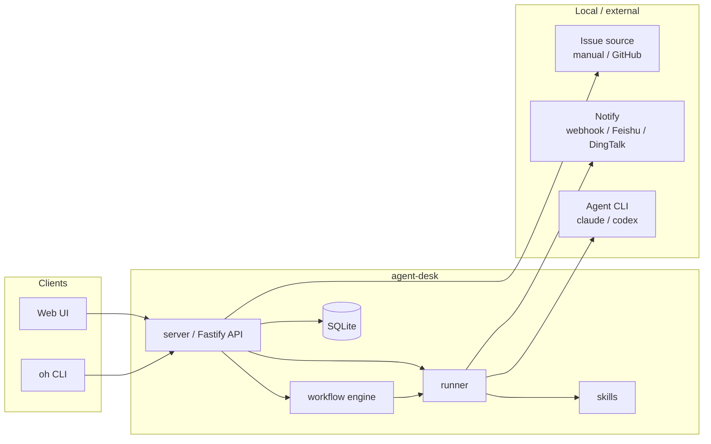
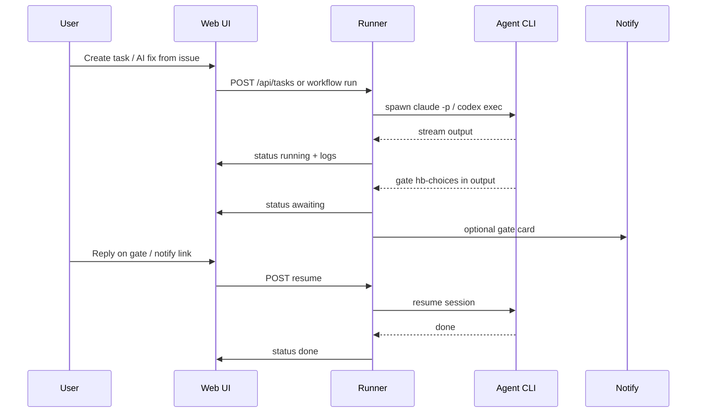
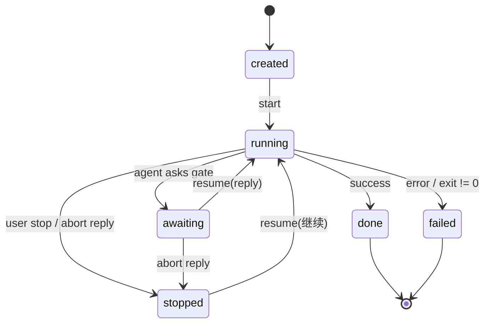
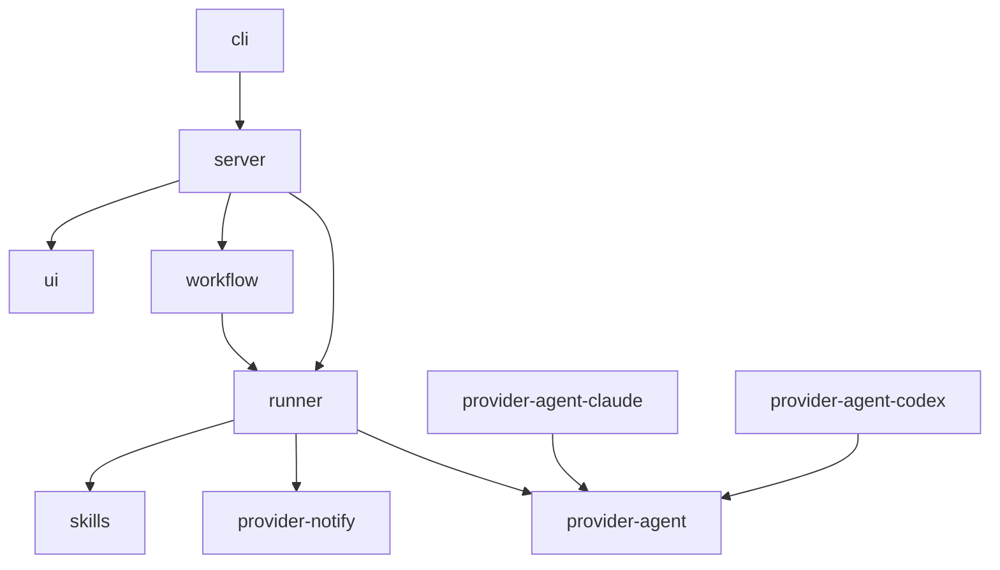

# agent-desk

Open-source **Agent task harness**: workflows, human gates, and pluggable providers.

Run coding agents (Claude Code, Codex) from a local Web UI or CLI, pause on human gates, and notify via webhook / Feishu / DingTalk. JSON Schemas in `schemas/` define portable task, workflow, and settings shapes.

## Architecture

### System overview



**Data directory** (default `~/.agent-desk`): `agent-desk.db`, user workflows, synced skills, optional GitHub auto-clone workspaces.

### End-to-end flow (example)



### Task lifecycle



### Pluggable providers

| Kind | Interface | Built-in backends |
|------|-----------|-------------------|
| **Agent** | `@agent-desk/provider-agent` | `claude`, `codex` |
| **Issue** | `@agent-desk/provider-issue` | `manual`, `github` |
| **Notify** | `@agent-desk/provider-notify` | `webhook`, `feishu`, `dingtalk` |

Register new backends at server/CLI startup; see [docs/providers.md](docs/providers.md).

### Package graph



More detail: [docs/architecture.md](docs/architecture.md).

## Features (v0.2)

- Task lifecycle: `created → running → awaiting → done | failed | stopped`
- **Workflow engine**: shared / independent modes, YAML templates, multi-step orchestration
- Human gate parsing (`## hb-choices`, abort replies like `先不修`)
- **Web UI**: overview dashboard, task list, gates, workflow templates & runs, skills
- Pluggable providers:
  - **Agent**: Claude Code / Codex
  - **Issue**: manual or **GitHub Issues**
  - **Notify**: webhook / **Feishu** / **DingTalk**
- **Skills**: portable `SKILL.md` packs (discover + prompt / `--add-dir` mount) — [docs/skills.md](docs/skills.md)
- SQLite persistence + local HTTP API + `oh` CLI

## Quick start

```bash
cd agent-desk
pnpm install
pnpm build

# Start web server + UI in background (default)
pnpm cli web

# Foreground mode
pnpm cli web --foreground

# Stop background server
pnpm cli web --stop

# List workflow templates
pnpm cli workflows list

# Run fix pipeline workflow
pnpm cli workflows run sys-fix-pipeline -p "Issue: login button broken"

# Create a single skill task
pnpm cli tasks create \
  -t "Demo task" \
  -p "Say hello and open gate「Demo」with hb-choices." \
  --skill triage

pnpm cli skills list
pnpm cli skills sync
pnpm cli issues list
pnpm cli tasks list
```

Open **http://127.0.0.1:19877** for the Web UI.

**CLI troubleshooting**

- Run commands from the **repo root** (`agent-desk/`), not `packages/cli/`.
- After clone or dependency changes: `pnpm install && pnpm build`.
- Prefer `pnpm cli <subcommand>` or `oh <subcommand>` after `npm link` in `packages/cli`.
- `pnpm --filter @agent-desk/cli exec oh` does **not** work for the `oh` bin.

## Coding agents

agent-desk spawns **local CLI tools** on the machine that runs `oh web`. It does not store model API keys in SQLite; authentication is handled by each CLI.

Set the default backend in Web **Settings → 默认编码 Agent** (`Settings.codingAgent`: `claude` | `codex`).

### Claude Code

| Item | Notes |
|------|-------|
| Backend | `provider-agent-claude` |
| Binary | `claude` (`AD_CLAUDE_BIN`) |
| Spawn | `claude -p --output-format stream-json ...` |

```bash
claude --version
claude -p "say hi"
```

Credentials (pick one): `ANTHROPIC_API_KEY` or `claude login`.

### Codex

| Item | Notes |
|------|-------|
| Backend | `provider-agent-codex` |
| Binary | `codex` (`AD_CODEX_BIN`) |
| Spawn | `codex exec --json ...` |

```bash
codex --version
codex exec --json --dangerously-bypass-approvals-and-sandbox -C . "say hi"
```

Credentials: `codex login`, `OPENAI_API_KEY`, or `~/.codex/config.toml`. Optional `AD_CODEX_MODEL` for `-m`.

If the CLI is missing or not authenticated, tasks stay at `created` or fail — use **Run** in the UI or `POST /api/tasks/:id/start` after fixing the CLI.

## Workflow modes

| Mode | Behavior |
|------|----------|
| **shared** | One agent session across all steps; orchestrator injects step prompts |
| **independent** | Each step spawns a separate task (parallel) |

Templates: `templates/workflows/*.yaml`. User workflows: `~/.agent-desk/workflows/`.

**缺陷 AI 修复**: Settings → **缺陷 AI 修复流程** — workflow template, or **单任务（技能模式）** for a single skill task.

## Configuration

Most options are in Web **Settings** (persisted to `~/.agent-desk/agent-desk.db`). Non-empty `AD_*` env vars override stored values where noted.

### Server

| Variable | Description |
|----------|-------------|
| `AD_DATA_DIR` | Data directory (default `~/.agent-desk`) |
| `AD_PORT` | Server port (default `19877`) |
| `AD_HOST` | Server host (default `127.0.0.1`) |

### Coding agent

| Variable | Description |
|----------|-------------|
| `AD_CLAUDE_BIN` | Claude CLI binary (default `claude`) |
| `AD_CODEX_BIN` | Codex CLI binary (default `codex`) |
| `AD_CODEX_MODEL` | Optional model for Codex (`codex exec -m`) |

### Notify — webhook

| Variable | Description |
|----------|-------------|
| `AD_NOTIFY_WEBHOOK_URL` | Webhook URL for gate/task notifications |

### Issue — GitHub

| Variable | Description |
|----------|-------------|
| `AD_GITHUB_TOKEN` | GitHub PAT for Issues API |
| `AD_GITHUB_REPO` | `owner/repo` for GitHub Issues provider |
| `AD_GITHUB_PROJECT_DIR` | Optional default `projectDir` on mapped issues |
| `AD_GITHUB_API_BASE` | Optional API host (GHES); default `https://api.github.com` |

### Notify — Feishu / Lark

| Variable | Description |
|----------|-------------|
| `AD_FEISHU_APP_ID` | Feishu / Lark app id |
| `AD_FEISHU_APP_SECRET` | Feishu / Lark app secret |
| `AD_FEISHU_RECEIVE_ID` | Recipient (`open_id` / email / `chat_id`, …) |
| `AD_FEISHU_RECEIVE_ID_TYPE` | Default `open_id` |
| `AD_FEISHU_API_BASE` | Default `https://open.feishu.cn` (Lark intl: `https://open.larksuite.com`) |

### Notify — DingTalk

| Variable | Description |
|----------|-------------|
| `AD_DINGTALK_WEBHOOK` | DingTalk custom robot webhook URL |
| `AD_DINGTALK_SECRET` | DingTalk robot SEC secret (加签) |
| `AD_DINGTALK_KEYWORD` | Custom keyword injected into card text (自定义关键词) |
| `AD_DINGTALK_APP_KEY` | DingTalk app key (工作通知模式) |
| `AD_DINGTALK_APP_SECRET` | DingTalk app secret |
| `AD_DINGTALK_AGENT_ID` | DingTalk agent id |
| `AD_DINGTALK_USER_IDS` | Comma-separated userids for work notification |
| `AD_DINGTALK_API_BASE` | Default `https://oapi.dingtalk.com` |
| `AD_DINGTALK_WRAP_LINKS` | `1` (default) wrap links for PC external browser |
| `AD_DINGTALK_CARD_TEMPLATE_ID` | Interactive card template id (`xxx.schema`); enables Stream gate cards |
| `AD_DINGTALK_OPEN_API_BASE` | Default `https://api.dingtalk.com` (createAndDeliver) |

### Skills

| Variable | Description |
|----------|-------------|
| `AD_SKILL_DIRS` | Extra skill roots (`:` / `;` separated) |
| `AD_BUNDLED_SKILL_DIR` | Override bundled `templates/skills` |
| `AD_SKILL_PROMPT_MAX_CHARS` | Cap for injected SKILL.md body (default `100000`) |

DingTalk 也可在 Web **设置 → 钉钉** 配置；改 AppKey/模板后需重启 `oh web` 重连 Stream.

## Documentation

| Doc | Contents |
|-----|----------|
| [docs/architecture.md](docs/architecture.md) | Design goals, gate protocol, state machine |
| [docs/providers.md](docs/providers.md) | Agent / Issue / Notify setup |
| [docs/skills.md](docs/skills.md) | Skill discovery, sync, mount |

## Monorepo layout

```
packages/
  core/                  # Types, gate parsing, limits
  db/                    # SQLite storage
  runner/                # Task execution
  workflow/              # Workflow loader, engine, run store
  server/                # HTTP API + static UI
  ui/                    # Web UI (static HTML/CSS/JS)
  cli/                   # oh CLI (`oh web`, `oh tasks`, …)
  provider-agent/        # Agent backend interface
  provider-agent-claude/ # Claude Code backend
  provider-agent-codex/  # Codex CLI backend
  provider-issue/        # Issue provider interface
  provider-issue-manual/ # In-memory manual issues
  provider-issue-github/ # GitHub Issues
  provider-notify/       # Notify provider interface
  provider-notify-webhook/
  provider-notify-feishu/
  provider-notify-dingtalk/
  skills/                # Skill discovery + mount helpers
schemas/                 # JSON Schema (language-agnostic)
templates/workflows/     # Example workflow YAML
templates/skills/        # Bundled SKILL.md packs (triage/fix/test)
```

## License

Apache-2.0
