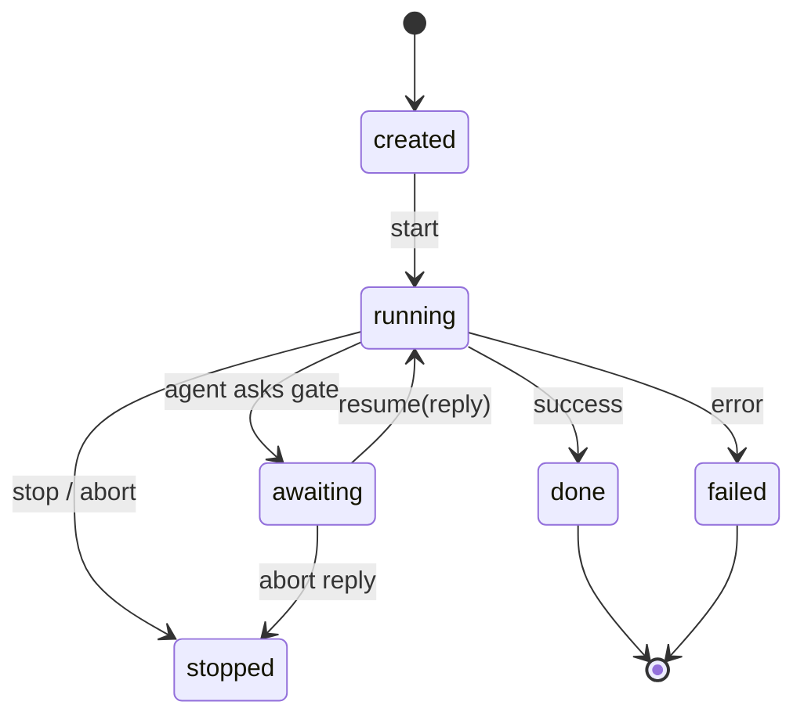
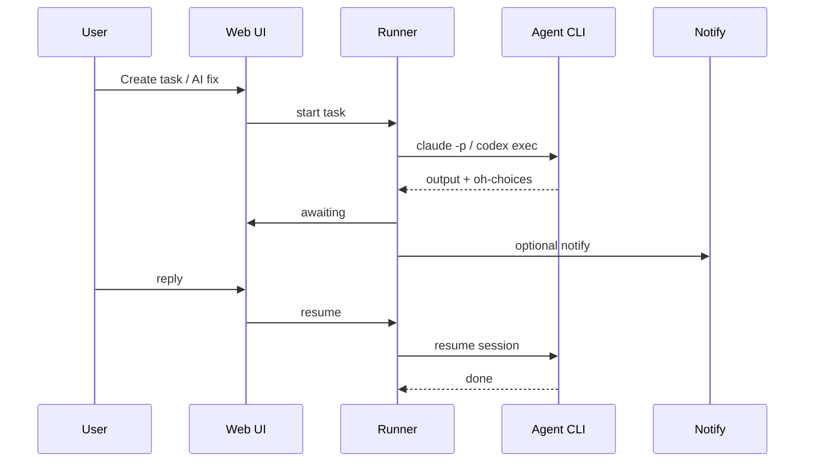

<p align="center">
  <a href="https://github.com/yangjieling/agent-desk">
    
  </a>
  <br><br>
  <strong style="font-size:40px;font-weight:700;letter-spacing:-0.02em;color:#202124">agent-desk</strong>
  <br>
  <sub>本地 Agent 编排 · 人工卡点 · 工作流</sub>
</p>

# agent-desk

**会停下来等你确认的编码 Agent。**

agent-desk 是一个开源、**本地优先**的 AI 编码 Agent 编排框架。通过 Web UI 或 CLI 运行 Claude Code 或 Codex，
编排多步工作流，在人工卡点处暂停，并在需要决策时通知团队 —— 无需部署云端控制面。

[](LICENSE)

[English](README.md) | **简体中文**

[架构](#架构) · [快速开始](#快速开始) · [docs/architecture.md](docs/architecture.md) · [docs/providers.md](docs/providers.md) · [docs/skills.md](docs/skills.md) · [docs/security.md](docs/security.md)

---

## 什么是 agent-desk？

你可能已经在终端里跑 `claude` 或 `codex`。每次会话都像黑盒：难以回放、容易丢上下文，无人值守又有风险。
当你想要 **修这个 Issue → 确认方案 → 跑测试 → 通知我** 时，往往只能反复提示、盯着终端。

agent-desk 在本机用一个小型 harness 把这些 CLI 包起来：

- **任务** 有清晰生命周期（`created → running → awaiting → done`）
- **工作流**（共享或独立步骤）由 YAML 模板驱动
- **人工卡点** 从 Agent 输出解析（`## oh-choices`）
- **通知**（Webhook、飞书、钉钉）带深链回到卡点
- **技能** 以可移植的 `SKILL.md` 包挂载进 Agent 提示词

数据保存在 `~/.agent-desk`（SQLite + 文件）。`schemas/` 中的 JSON Schema 保证任务/工作流结构可移植。

---

## 跑起来。

*从 GitHub Issue、技能任务，或完整修复流水线开始。*

- **Agent 后端 →** [Claude Code](#agent-运行时) 与 [Codex](#agent-运行时)，通过本地 CLI 拉起（`claude -p`、`codex exec`）。
- **[工作流](templates/workflows/) →** `shared`（单会话多步骤）或 `independent`（并行子任务）。
- **[技能](docs/skills.md) →** 发现、同步并在任务启动时注入 `SKILL.md` 与 `--add-dir` 挂载。
- **Issue → 任务 →** GitHub Issues 提供方，缺陷列表 **AI 修复**，可选自动克隆工作区。

## 保持知情。

*Agent 提议，你来批准。*

- **人工卡点 →** Agent 输出 `## oh-choices`；任务进入 `awaiting`，直到你在 UI 或通过通知链接回复。
- **执行日志 →** 任务时间轴中的带时间戳 stdout/stderr（抽屉中可查看原始 JSONL）。
- **通知 →** Webhook、飞书/Lark 卡片、钉钉 ActionCard 或互动 Stream 卡片。
- **继续 / 停止 →** 用回复继续、用 `先不修` / `skip` 中止，或在 UI 停止运行中的任务。

## 按需定制。

*可插拔提供方，harness 本身不绑定厂商。*

- **[Provider 接口](docs/providers.md) →** 在代码中替换 Agent、Issue、Notify 后端。
- **设置 UI →** 默认 Agent、GitHub 仓库、钉钉凭据、修复工作流或仅技能模式。
- **环境变量覆盖 →** 设置 `AD_*` 时覆盖已存配置（见[配置](#配置)）。
- **Schema 优先 →** 任务、工作流、设置结构在 `schemas/`，便于工具与交换。

---

## 快速开始

**前置条件：** [Node.js](https://nodejs.org/) 20+、[pnpm](https://pnpm.io/) 9+，以及至少一个已安装并完成认证的
[Agent CLI](#agent-运行时)（在运行 `oh web` 的机器上）。

```bash
git clone https://github.com/yangjieling/agent-desk.git
cd agent-desk
pnpm install && pnpm build

pnpm cli web          # 后台运行（默认）
# pnpm cli web --foreground
# pnpm cli web --stop
```

打开 **http://127.0.0.1:19877**

```bash
pnpm cli tasks create -t "Hello" -p "Say hi." --skill triage
pnpm cli workflows list
pnpm cli workflows run sys-fix-pipeline -p "Issue: login button broken"
```

**CLI 提示：** 在仓库根目录执行；使用 `pnpm cli <cmd>`，或在 `packages/cli` 下 `npm link` 后使用 `oh`。

---

## 五分钟完成第一个任务

**1. 安装 Agent CLI。** 在将运行任务的主机上执行 `claude login` 或 `codex login`。

**2. 启动 harness。** `pnpm cli web` 并打开 Web UI。

**3. 选择工作区。** **新建任务** → 选择 Agent 应工作的项目目录。

**4. 创建并运行。** 输入提示词（或在提示词中加入 `oh-choices` 演示卡点）。提交后
观察日志，状态变为 **awaiting** 时回复即可。

**从 GitHub Issue：** 配置 **设置 → GitHub**，然后 **缺陷** → **AI 修复**（工作流或技能模式）。

---

## Agent 运行时

agent-desk 不内置模型，只驱动你本地安装的 CLI。

| Provider | CLI | 设置项 | 环境变量 |
| --- | --- | --- | --- |
| Claude Code | `claude` | `Settings.codingAgent`: `claude` | `AD_CLAUDE_BIN` |
| OpenAI Codex | `codex` | `Settings.codingAgent`: `codex` | `AD_CODEX_BIN`, `AD_CODEX_MODEL` |
| Cursor Agent | `agent` | `Settings.codingAgent`: `cursor` | `AD_CURSOR_BIN`, `AD_CURSOR_MODEL`, `CURSOR_API_KEY` |

```bash
# 创建任务前先验证
claude --version && claude -p "say hi"
codex --version && codex exec --json -C . "say hi"
agent --version && agent -p --trust --output-format text "say hi"
```

凭据在各 CLI 中管理（`ANTHROPIC_API_KEY`、`claude login`、`OPENAI_API_KEY`、`~/.codex/config.toml`）——不在 agent-desk 的 SQLite 里。

更多后端：实现 `@agent-desk/provider-agent` 并在启动时注册 —— 见 [docs/providers.md](docs/providers.md)。

---

## 文档

| 我想… | 从这里开始 |
| --- | --- |
| 理解整体设计 | [docs/architecture.md](docs/architecture.md) |
| 接入 GitHub Issues / 通知渠道 | [docs/providers.md](docs/providers.md) |
| 使用或编写技能 | [docs/skills.md](docs/skills.md) |
| 对照 Multica 的学习清单 | [docs/learn-from-multica.md](docs/learn-from-multica.md) |
| 本机 HTTP API（OpenAPI） | [schemas/openapi.yaml](schemas/openapi.yaml) · 运行时 `http://127.0.0.1:19877/api/docs` |
| 任务运行界面 UI 优化（待实现） | [docs/task-session-ui.md](docs/task-session-ui.md) |
| 查看任务状态与卡点 | 下文 [架构 → 任务生命周期](#架构) |
| 配置环境变量 | [配置](#配置) |
| 开发 monorepo | [开发](#开发) |

---

## 架构

```
     Web UI (static)  ·  oh CLI
              │
              ▼
     ┌─────────────────┐
     │  Fastify server │──────► SQLite (~/.agent-desk)
     └────────┬────────┘
              │
     ┌────────┴────────┐
     │ workflow engine │──► YAML templates, shared / independent runs
     └────────┬────────┘
              │
     ┌────────┴────────┐
     │     runner      │──► skills mount, gate parse, notify
     └────────┬────────┘
              │ spawn
     ┌────────┴────────────────────────┐
     │  claude  ·  codex  (+ providers) │
     └──────────────────────────────────┘
```

| 层级 | 技术栈 |
| --- | --- |
| UI | 静态 HTML/CSS/JS（`@agent-desk/ui`） |
| API | Fastify（`@agent-desk/server`） |
| 引擎 | TypeScript 工作流 + runner（`@agent-desk/workflow`、`@agent-desk/runner`） |
| 存储 | SQLite（`@agent-desk/db`） |
| Agent | 本地 CLI 后端（`provider-agent-*`） |
| Schema | `schemas/` 中的 JSON Schema |

### 任务生命周期



### 端到端流程



包依赖图与卡点协议：[docs/architecture.md](docs/architecture.md)。

---

## 工作流模式

| 模式 | 行为 |
|------|----------|
| **shared** | 单 Agent 会话贯穿多步；编排器注入各步提示词 |
| **independent** | 每步为独立任务（可并行） |

模板：`templates/workflows/*.yaml` · 用户工作流：`~/.agent-desk/workflows/`

**缺陷 AI 修复：** 设置 → **缺陷 AI 修复流程**（如 `sys-fix-pipeline`）或 **单任务（技能模式）**。

---

## 配置

Web **设置** 持久化到 `~/.agent-desk/agent-desk.db`。非空的 `AD_*` 环境变量会覆盖已存值。

<details>
<summary><strong>环境变量</strong>（点击展开）</summary>

### 服务

| 变量 | 说明 |
|----------|-------------|
| `AD_DATA_DIR` | 数据目录（默认 `~/.agent-desk`） |
| `AD_PORT` | 服务端口（默认 `19877`） |
| `AD_HOST` | 监听地址（默认 `127.0.0.1`） |

### 编码 Agent

| 变量 | 说明 |
|----------|-------------|
| `AD_CLAUDE_BIN` | Claude CLI 可执行文件（默认 `claude`） |
| `AD_CODEX_BIN` | Codex CLI 可执行文件（默认 `codex`） |
| `AD_CODEX_MODEL` | Codex 可选模型（`-m`） |
| `AD_CURSOR_BIN` | Cursor Agent CLI 可执行文件（默认 `agent`） |
| `AD_CURSOR_MODEL` | Cursor 可选模型（`--model`） |

### 通知 — Webhook

| 变量 | 说明 |
|----------|-------------|
| `AD_NOTIFY_WEBHOOK_URL` | 卡点/任务通知的 Webhook URL |

### Issue — GitHub

| 变量 | 说明 |
|----------|-------------|
| `AD_GITHUB_TOKEN` | GitHub PAT |
| `AD_GITHUB_REPO` | `owner/repo` |
| `AD_GITHUB_PROJECT_DIR` | 默认检出路径 |
| `AD_GITHUB_API_BASE` | API 地址（默认 `https://api.github.com`） |

### 通知 — 飞书 / Lark

| 变量 | 说明 |
|----------|-------------|
| `AD_FEISHU_APP_ID` | 应用 ID |
| `AD_FEISHU_APP_SECRET` | 应用密钥 |
| `AD_FEISHU_RECEIVE_ID` | 接收方 ID |
| `AD_FEISHU_RECEIVE_ID_TYPE` | 默认 `open_id` |
| `AD_FEISHU_API_BASE` | 默认 `https://open.feishu.cn` |

### 通知 — 钉钉

| 变量 | 说明 |
|----------|-------------|
| `AD_DINGTALK_WEBHOOK` | 机器人 Webhook URL |
| `AD_DINGTALK_SECRET` | SEC 加签密钥 |
| `AD_DINGTALK_KEYWORD` | 自定义关键词 |
| `AD_DINGTALK_APP_KEY` | 应用 Key（工作通知） |
| `AD_DINGTALK_APP_SECRET` | 应用 Secret |
| `AD_DINGTALK_AGENT_ID` | Agent ID |
| `AD_DINGTALK_USER_IDS` | 逗号分隔的 userid |
| `AD_DINGTALK_API_BASE` | 默认 `https://oapi.dingtalk.com` |
| `AD_DINGTALK_WRAP_LINKS` | `1`（默认）在 PC 浏览器中包装链接 |
| `AD_DINGTALK_OPEN_API_BASE` | 默认 `https://api.dingtalk.com` |
| `AD_DINGTALK_CARD_TEMPLATE_ID` | Stream 互动卡片模板（`xxx.schema`） |

### 技能

| 变量 | 说明 |
|----------|-------------|
| `AD_SKILL_DIRS` | 额外技能根目录 |
| `AD_BUNDLED_SKILL_DIR` | 覆盖内置 `templates/skills` |
| `AD_SKILL_PROMPT_MAX_CHARS` | 注入 SKILL.md 最大字符数（默认 `100000`） |

钉钉也可在 Web **设置 → 钉钉** 配置；修改 AppKey/模板后需重启 `oh web` 以重连 Stream。

</details>

---

## 开发

```bash
pnpm install && pnpm build    # 编译所有包
pnpm cli web --foreground     # 前台运行服务
pnpm typecheck                # TypeScript 检查
```

### Monorepo 结构

```
packages/
  core/ db/ runner/ workflow/ server/ ui/ cli/
  provider-agent/ provider-agent-claude/ provider-agent-codex/
  provider-issue*/ provider-notify*/ skills/
schemas/  templates/workflows/  templates/skills/
```

---

## 许可证

Apache-2.0
