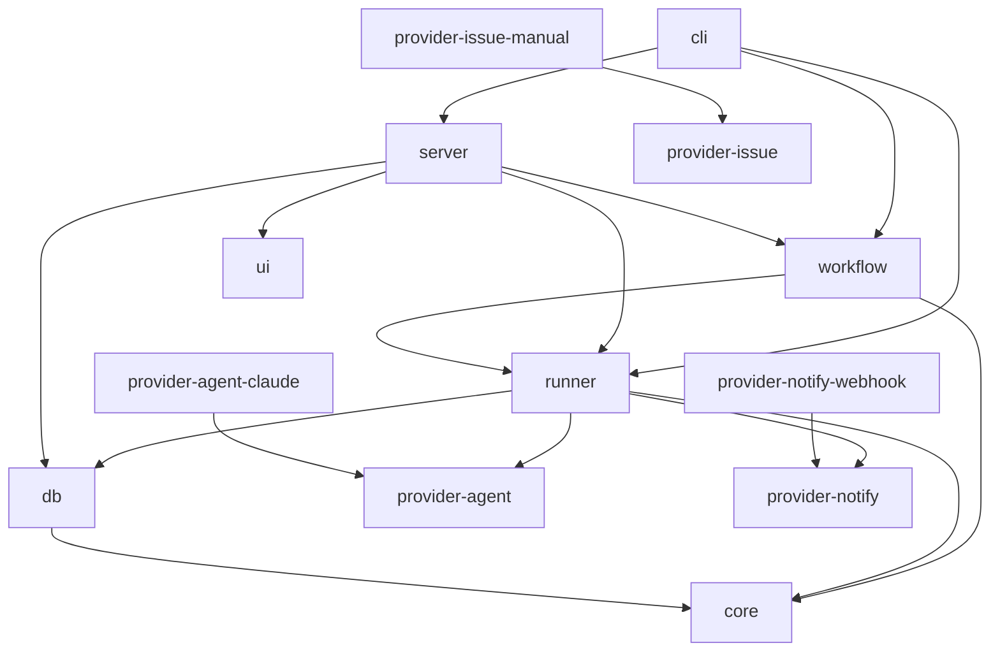
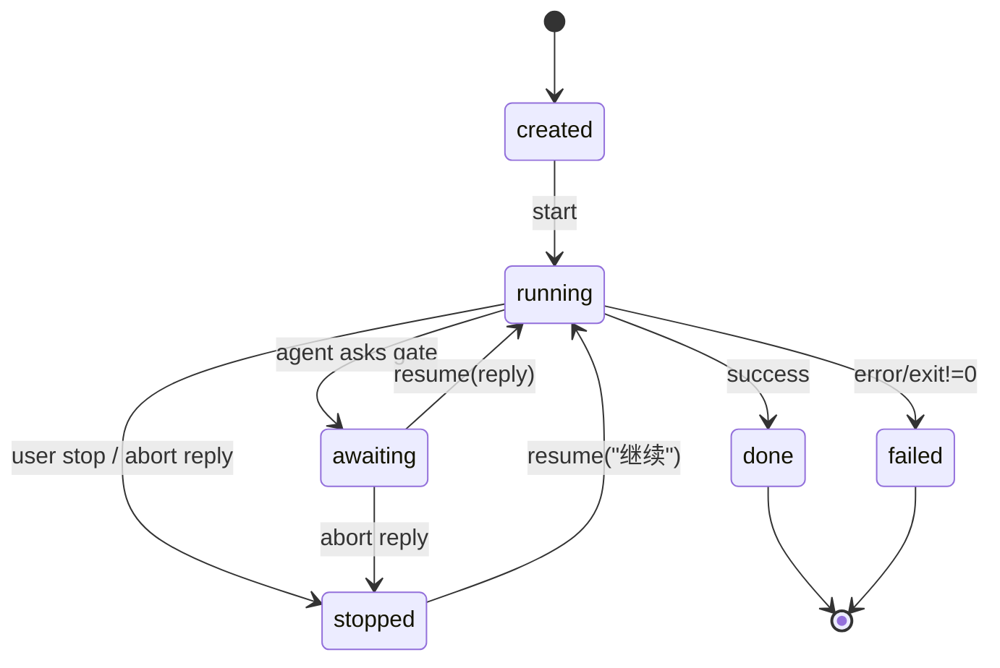

# Architecture

## Design goals

1. **Pluggable providers** — Agent, Issue, and Notify backends are swappable.
2. **Schema-first** — Task/Workflow/Settings/Gate schemas live in `schemas/` and can be shared with Python hb-cli without sharing code.
3. **Local-first** — SQLite + localhost API; no cloud dependency for the OSS core.

## Package graph



## Task state machine



## Gate protocol

Agents signal a human gate by including:

```markdown
## 闸门「Triage」

Please confirm next step.

## hb-choices
- 继续修复 | continue
- 先不修 | skip
```

The runner parses `hb-choices`, sets status to `awaiting`, and optionally sends a webhook notification.

Abort replies (`skip`, `cancel`, `先不修`, …) stop the task instead of advancing.

## Phase 2 (partially done in v0.2)

- Web UI package (`@agent-desk/ui`) — task list, gates, workflow runs
- Workflow engine — shared / independent modes, YAML templates
- OpenAPI spec under `schemas/openapi.yaml` (planned)
- Additional providers (GitHub Issues, Slack, Cursor SDK)
