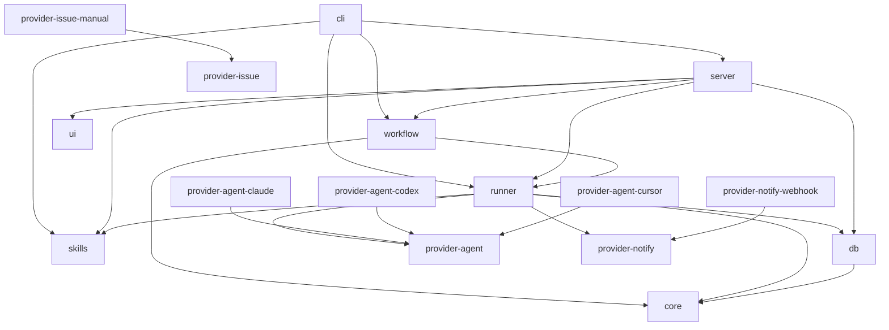
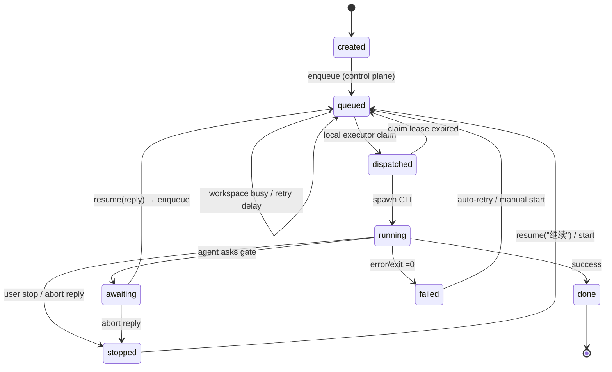

# Architecture

## Design goals

1. **Pluggable providers** — Agent, Issue, and Notify backends are swappable.
2. **Schema-first** — Task/Workflow/Settings/Skill schemas live in `schemas/` for language-agnostic interchange.
3. **Local-first** — SQLite + localhost API; no cloud dependency for the OSS core. Process boundary = the OS user running the harness (see [security.md](./security.md)).
4. **Portable skills** — Skill packs are harness-owned descriptors; agents only receive mount (prompt + dirs).

## Package graph



## Skills

See [skills.md](./skills.md). Workflow nodes reference a skill **id**; `@agent-desk/skills` resolves `SKILL.md` at run time and the runner injects a prompt prefix + `extraSkillDirs` (Claude `--add-dir`).
## Task state machine



Control plane (HTTP / Autopilot) **enqueues** only. The in-process **LocalExecutor** claims under a heartbeat lease (`dispatched`), then calls `startTask` to spawn the CLI. See `GET /api/executor`. Remote multi-machine daemons remain out of scope for the local-first MVP.

## Gate protocol

Agents signal a human gate by including:

```markdown
## 闸门「Triage」

Please confirm next step.

## oh-choices
- 继续修复 | continue
- 先不修 | skip
```

The runner parses `oh-choices`, sets status to `awaiting`, and optionally sends a webhook notification.

Abort replies (`skip`, `cancel`, `先不修`, …) stop the task instead of advancing.

## Phase 2 (partially done in v0.2)

- Web UI package (`@agent-desk/ui`) — task list, gates, workflow runs
- Workflow engine — shared / independent modes, YAML templates
- OpenAPI spec under `schemas/openapi.yaml` ✅ — served at `/openapi.yaml` and browsable at `/api/docs`
- Additional providers (GitHub Issues ✅, Feishu notify ✅, DingTalk notify ✅, Slack, Cursor SDK)
